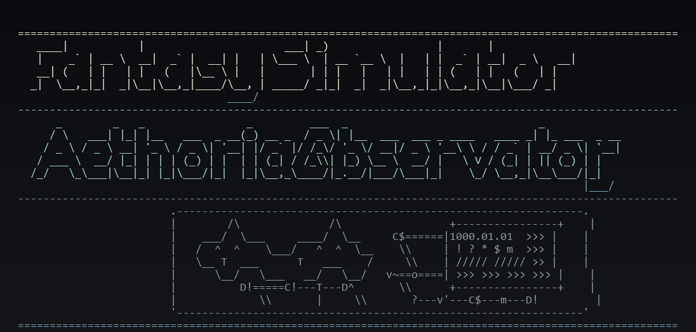

# Fantasy Simulator

A Python CLI world and life simulation set in the fantasy world of Aethoria.

This project is not a separate RPG battle loop. Characters live inside the same
world simulation, form relationships, travel, age, fight, discover things, and
take part in multi-step adventures that the player can inspect and occasionally
influence.



## Features

- Yearly CLI progression backed by a day-granular simulation engine
- Deterministic annual aging for all living characters after each full in-world year
- Setting-bundle calendars with named / irregular months and room for in-world calendar changes
- Character generation with random and template-based creation
- Event system for meetings, journeys, discoveries, training, battles, aging,
  marriage, and natural death
- Character roster, story output, simulation summaries, and structured event logs
- Auto-advance until meaningful pause conditions are met
- Monthly and yearly reports derived from structured event records
- World memory features:
  - live traces
  - memorials
  - location aliases
- Integrated adventure runs with:
  - summary logs
  - detailed logs
  - pending player choices
  - automatic default resolution when choices are left unresolved
- Terrain/site/route world representation with:
  - variable world dimensions
  - ASCII grid rendering
  - atlas overview rendering
  - region drill-down
  - location detail panels
- Save/load support for simulation snapshots
- Schema-versioned save migration support for older data (`schema_version = 9`)
- Structured world event records with causal impact tracking and rumors
- UI abstraction through input/render backends plus lightweight presenter/view-model layers
- CLI localization support for Japanese and English

## Running

Requirements:

- Python 3.10+
- Dependencies are declared in `pyproject.toml`
- Optional UI extras:
  - `rich` (thin Rich render shell)
  - `prompt_toolkit` (input assistance backend)
  - `wcwidth` (wide-character display width handling)

Install development dependencies:

```bash
uv sync --extra dev
```

Install development dependencies plus the optional UI extras:

```bash
uv sync --extra dev --extra ui
```

If you prefer `pip`, the same metadata can be installed from `pyproject.toml`:

```bash
python -m pip install -e ".[dev]"
python -m pip install -e ".[dev,ui]"
```

Start the CLI:

```bash
python -m fantasy_simulator
```

Optional backend selection (explicit opt-in):

```bash
# default: StdInputBackend + PrintRenderBackend
export FANTASY_SIMULATOR_INPUT_BACKEND=prompt_toolkit
export FANTASY_SIMULATOR_UI_BACKEND=rich
python -m fantasy_simulator
```

Or using the legacy entry point:

```bash
python main.py
```

The codebase uses a `fantasy_simulator/` package layout with a `simulation/`
sub-package for separated concerns (engine, timeline, notifications, event
recording, adventure coordination, and query/reporting). The UI layer is
abstracted through `InputBackend` / `RenderBackend` protocols, a `UIContext`
dependency container, renderer modules, and presenter/view-model helpers. The
current roadmap is maintained in
[`docs/implementation_plan.md`](docs/implementation_plan.md), and the current
repo-level guardrails are summarized in
[`docs/architecture.md`](docs/architecture.md). Language authoring and debug
contracts live in [`docs/language_engine.md`](docs/language_engine.md).

**Compatibility note (PR-A):** CLI launch (`python -m fantasy_simulator` and
`python main.py`) and save/load compatibility are preserved. However, old
bare-module imports such as `from i18n import tr` or `from world import World`
are **no longer supported**. All imports must now use the package path, e.g.
`from fantasy_simulator.i18n import tr`,
`from fantasy_simulator.world import World`.

Run tests:

```bash
python -m pytest
```

Agent-oriented verification profiles:

```bash
python scripts/quality_gate.py minimal --pytest-target tests/test_character_creator.py
python scripts/quality_gate.py standard
python scripts/quality_gate.py playtest
python scripts/quality_gate.py strict
python scripts/quality_gate.py exhaustive
```

Minimal role-based orchestration (planner -> implementer -> verifier -> reviewer):

```bash
python scripts/agent_orchestrator.py "Add bounded orchestration contract" \
  --plan-anchor PR-I-orchestrator \
  --changed-file scripts/agent_orchestrator.py \
  --changed-file tests/test_agent_orchestrator.py \
  --consulted-design-text docs/implementation_plan.md \
  --consulted-design-text docs/architecture.md \
  --narrative-doc-revalidated docs/contexts/review.md \
  --canonical-source-note "World.event_records contract reviewed"
```

Run artifacts are persisted as `.runs/<task-id>/manifest.json` for machine-readable workflow traces.

When `minimal` is selected for docs-only changes, orchestrator picks path-aware
targets (e.g., role-contract docs include `test_agent_workflow_docs.py` plus
`test_doc_freshness.py`).

For high-impact areas (architecture/roadmap source-of-truth docs, narrative,
observer-facing UI/report paths), semantic-audit inputs are required. Provide at
least one `--consulted-design-text` and one `--canonical-source-note`, and for
narrative changes also provide `--narrative-doc-revalidated`.

`minimal` is intentionally explicit: pass one or more `--pytest-target` values
for the changed area you want to verify.

`standard` is the repo's day-to-day guardrail profile. It exercises the
architecture constraints, the quality-gate self-test, the agent workflow docs
checks, doc freshness, and the harness scenario suite.

`playtest` runs deterministic world-health bands for long-run population,
social, adventure, and combat regressions.

`strict` adds lint, complexity, focused mypy over the `[tool.mypy]` file list,
and the playtest bands without re-running the full suite. Use `exhaustive` for
static checks plus one full pytest pass. The focused type-check target
list is mirrored by `scripts/quality_gate.py` and guarded by
`tests/test_quality_gate.py`; workflow
coverage should be reviewed against the same list when CI changes are in scope.

## Project Structure

```
fantasy_simulator/          # Main package
  __init__.py
  __main__.py               # python -m fantasy_simulator entry point
  main.py                   # CLI logic
  character.py              # Core character model
  character_creator/        # Random, template, and interactive character creation
  character_model/          # Character value objects, serialization, personality, and presentation helpers
  combat_system/            # Combat resolution and combat-log read models
  world.py                  # World state, locations, memory, terrain hooks, serialization
  terrain/                  # Terrain / site / route / atlas layout models
  events/                   # Event generation facade (re-exports event contracts)
  world_event/              # Event contracts, rendering, history indexes, logs, and state mutation helpers
  world_location/           # Location state, lookup, reference, and structure helpers
  world_calendar/           # Calendar resolution, facade, and World mixin helpers
  world_core/               # Shared world records and structural protocols
  world_dynamics/           # World pressure, dynamic mutation, and transient era runtime helpers
  world_language/           # Language evolution, facade, and World mixin helpers
  world_topology/           # Route graph, topology queries, runtime, and restore helpers
  world_persistence/        # World serialization, hydration, and terrain persistence helpers
  world_actor/              # Character/adventure indexing and actor-facing World mixin helpers
  world_arc/                # Long-running world arc model and management helpers
  world_history/            # Long-run history retention helpers
  world_map/                # Headless map view models, ASCII rendering, and local map generation
  world_memory/             # Location memory helpers and memory/conflict World mixins
  world_state/              # Location-state decay and propagation helpers
  world_structure/          # World structure rebuild, load normalization, and reference repair helpers
  adventure/                # Multi-step adventure progression
  reports/                  # Monthly and yearly report view generation
  rumor/                    # Rumor generation and lifecycle helpers
  simulation/               # Simulator split into single-responsibility modules
    __init__.py             # Re-exports Simulator
    engine.py               # Core Simulator class (orchestration, loops, serialization)
    timeline.py             # Day-by-day processing, seasonal modifiers, dying/injury
    calendar.py             # Shared calendar/rate helpers for time progression
    notifications.py        # Notification threshold evaluation
    event_recorder.py       # Canonical event recording + compatibility projections
    adventure_coordinator.py # Adventure lifecycle management
    queries.py              # Summary, report, story, and event-log access
  persistence/
    save_load.py            # Snapshot save/load helpers
    migrations.py           # Schema migration for save compatibility
  ui/
    screens.py              # CLI screen and menu functions
    ui_helpers.py           # Display formatting and input utilities
    ui_context.py           # UIContext dependency container (InputBackend + RenderBackend)
    presenters.py           # Screen-friendly formatting helpers
    view_models.py          # UI-facing view models from canonical data
    map_renderer.py         # Map data extraction (MapCellInfo/MapRenderInfo) and ASCII rendering
    atlas_renderer.py       # Atlas-scale overview rendering
    input_backend.py        # InputBackend protocol + Std / PromptToolkit backends
    render_backend.py       # RenderBackend protocol + Print / Rich backends
  narrative/
    context.py              # Minimal NarrativeContext helpers for memorials / aliases
    template_history.py     # Template cooldown / selection helper
  language/
    schema.py               # Structured language and sound-change schema helpers
    phonology.py            # Token-aware sound change application and feature classes
    state.py                # Runtime language state and evolution history DTOs
    presets.py              # Historically inspired rule pools
    engine.py               # Naming, lexicon, toponym, and evolution engine
  content/
    world_data.py           # Legacy compatibility projections + shared skill catalog
  i18n/
    engine.py               # Localization helpers (tr, tr_term, set_locale)
    ja.py                   # Japanese text and terms
    en.py                   # English text and terms
main.py                     # Compatibility wrapper (delegates to package)
tests/                      # Automated tests
  support/                  # Shared test support utilities
docs/
  implementation_plan.md    # Implementation roadmap and phase order
  architecture.md           # Current architectural guardrails and canonical data rules
  language_engine.md        # Language package authoring/debug contracts
  td_backlog_status.md      # TD-1〜TD-4 audit snapshot (closed/current guardrails)
  contexts/                 # Short task-mode context docs for implementation/review
  session_handoffs/         # Template + latest repo-local handoff notes
  subagent_contract.md      # Delegation format for subagent tasks
  agent_lessons.md          # Curated recurring agent workflow lessons
  next_version_plan.md      # Long-range design target
  ui_renovation_plan.md     # UI renovation strategy
scripts/
  quality_gate.py           # minimal|standard|strict verification runner
  quality_gate.ps1          # Thin PowerShell wrapper for the quality gate
```

## CLI Flow

Current main menu:

- Start new simulation
- Create custom simulation
- Load saved simulation
- Read world lore
- Change language
- Exit

After a simulation starts or is loaded, the post-simulation menu currently
supports:

- advancing by 1 year / 5 years / auto-pause
- yearly and monthly reports
- atlas/world map browsing
- character roster and stories
- recent/full event log viewing
- adventure summaries, detail inspection, and pending-choice resolution
- save snapshots
- location history browsing

## Design Direction

- Adventures remain inside the main simulation instead of becoming a separate
  game mode.
- Player control is selective intervention at important moments.
- The same adventure supports normal summary viewing, deeper inspection, and
  rare player choice points.
- The world model is being expanded incrementally through terrain/site/route
  separation and atlas-scale observation UI.
- Save snapshots persist canonical `world.event_records`; `Simulator.history`
  and `World.event_log` are runtime compatibility projections with backward-load
  support for older snapshots.
- Event impact / propagation rules can be provided from the active
  `SettingBundle` (bundled defaults remain the fallback).
- Changes are being kept incremental and modular.

## Current Limitations

- Some generated event text is still English-first even when the CLI language is
  set to Japanese.
- Terrain generation is still deterministic scaffolding from the current site
  grid, not a full worldgen pipeline.
- NarrativeContext is still minimal and currently focused on memorial / alias
  text selection.
- The default Aethoria setting now loads from bundled setting data, but broader
  authoring / swapping workflows are still in progress.
- The simulation is tuned for readability and experimentation rather than
  perfect realism.

## Near-Term Priorities

- Treat the TD-1〜TD-4 technical-debt backlog as closed: canonical event-store
  adapters, bundle-owned world seeds, responsibility splits, and guardrail/doc
  sync now have tests around their intended boundaries.
- PR-J's first formal `SettingBundle` authoring pass is complete. PR-K's
  dynamic world-change mainline is complete: route/rename/occupation,
  war open/close, terrain mutation, era shift, civilization drift,
  characterization/golden masters, typed-ID ratchet, save policy, natural
  generation, SettingBundle rule/baseline inputs, and user-visible
  world-change integration all have guardrail coverage.
- The next mainline focus is map-screen improvement: make the existing
  atlas/region/detail views better expose route state, current control,
  world-change traces, and local decision cues without changing save shape.
- Treat the technical-review stream as PR-K support work: Python-version ADR,
  architecture override ledger metadata, and the v8 serializer/hydrator split
  reduce risk without changing the save JSON shape prematurely. The canonical
  event write path keeps duplicate-detection record IDs current without
  rebuilding the full mutation-sensitive event signature on each append, while
  read-side indexes still rebuild on demand. Ordinary activity, journey,
  lifecycle, health, relationship, and combat replay coverage now share the
  same semantic-record direction as auto-pause candidate collection;
  notification thresholds also read canonical actor ids plus semantic actor-id
  metadata.
  PR-K command boundaries normalize location, route, faction, event, era, and
  terrain-linked IDs before domain events become records, and war declaration,
  war ending, plus era/civilization APIs round-trip through canonical records
  without new runtime save fields. Era shifts and civilization score drift now
  also project into saved location-state pressure from canonical records.
  Monthly and yearly report cards now
  surface concrete world-change entries from the same canonical projections;
  the observer dashboard also includes a recent world-change entry list, and
  region/atlas maps mark sites touched by recent world-change records.
  Simulations now have a separate `world_changes_per_year` budget for natural
  route disruptions/reopenings, location-linked terrain mutations, and
  civilization drift, natural era shifts, natural official renames, plus faction-war
  openings/endings and war-driven location-control shifts; CLI-created runs
  enable this at 1/year without mixing it into ordinary character-event
  density. If a selected natural generator cannot produce a valid change in
  the current world state, the same budget slot falls back to another PR-K
  generator before giving up. Natural world-change records also pass through
  the notification threshold path, so they surface in pending notifications
  and can stop auto-advance with a world-change pause reason instead of only
  appearing later in reports or maps.
  Route block/reopen records now apply deterministic pressure to both endpoint
  locations, so travel disruption reaches state, trace, map, and save/load
  views. The dashboard now also surfaces currently blocked routes from the
  route-status projection until they reopen.
  War declarations and war endings now apply deterministic local pressure to
  affected sites while preserving the canonical-record projection/report path,
  and the war-map projection derives active faction wars from open/close
  records for dashboard visibility. The dashboard also surfaces current
  occupation/control state and current era/civilization phase from canonical
  projections. Controlling faction changes and location renames likewise adjust
  local pressure and traces after canonical recording succeeds, and
  location-linked terrain mutations now push local terrain pressure into state,
  trace, map, and save/load views.
- Treat worldgen PoC work as parallel technical validation, not the next
  blocking mainline milestone.

For the full roadmap (NarrativeContext, SettingBundle, worldbuilding, dynamic
world changes, etc.), see `docs/implementation_plan.md`.
